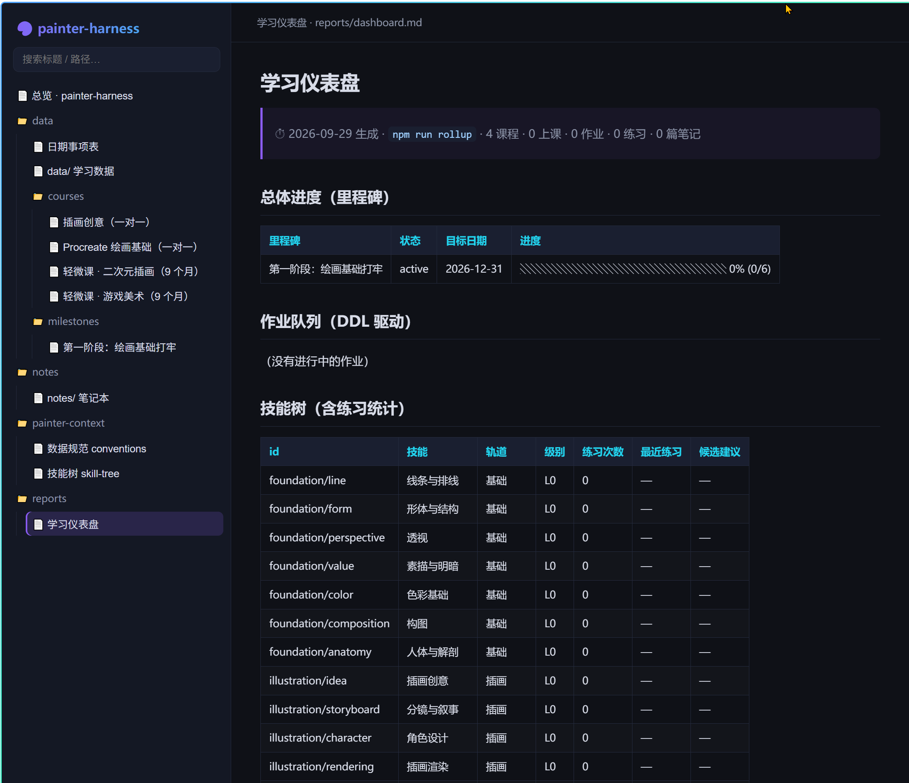

# painter-harness

这是一个为我个人学习画画打造的AI harness项目，我想通过给AI设定边界（harness）来辅助我的画画学习。

## 学习背景

我目前在学习画画通用扎实的基础、插画、游戏美术等内容。学习的资源有三个课程，两个老师一对一分别教授 Procreate 绘画基础和插画创意，一套在线课程"轻微课"，包含两套各为9个月的二次元插画及游戏美术，使用板绘 + PS 进行绘画。

期望课程结束时，我能掌握插画和游戏美术两个技能，为职业奠定扎实的基础。

## 项目主题

画画最重要的是练习，但是知道如何有效努力以及带上脑子思考如何画画，这部分也很重要。所以这个项目的主题是更好地帮助我练习、以及帮我巩固绘画知识点。

## 初步设想

这个项目会提供以下功能：

1. 课程内容的录入和组织，包括上课时间、内容，作业内容及DDL；
2. 根据作业DDL进行优先级安排；
3. 帮我记录练习和每次练习要达成的目的，为整体目标的拆分几个milstone，用目标进度条进行记录；
4. 根据每个完成情况，不断为我更新插画、游戏美术的绘画技能树；
5. 通过逐步进行，汇总出笔记本，AI agent能随时为我翻阅；
6. 按作业 DDL 动态调整优先级与本周安排。

## 项目结构

```text
painter-harness/
├── .github/
│   ├── copilot-instructions.md   # 规则层：AI 维护本仓库的铁律与优先级规则
│   ├── agents/                   # 多 agent 工作流：调研、规划、实施、审查与总控
│   ├── prompts/                  # 3 个工作流：记练习 / 排优先级 / 周复盘
│   └── skills/record-class/      # 录课工作流（skill）：课前预览 + 课后更新
├── painter-context/              # 唯一内容根（事实源 + 契约 + 汇总）
│   ├── conventions.md            #   数据 schema、命名、日期格式的唯一权威定义
│   ├── skill-tree.md             #   技能树定义 + L0–L5 评定标准（唯一需人工维护的表）
│   ├── README.md                 #   内容根说明、生命周期与边界对比
│   ├── 1-courses/                #   课程定义
│   ├── 2-plans/                  #   逐课程目标/阶段的学习计划（软窗口）
│   ├── 3-sessions/               #   按关联课程 id 分类的上课记录
│   ├── 4-assignments/            #   作业（真实 DDL，硬截止）
│   ├── 5-practice/               #   练习记录（已发生事实）
│   ├── 6-milestones/             #   里程碑 checklist
│   ├── notes/                    #   笔记：AI 汇总沉淀的知识点
│   ├── templates/                #   录入模板（session/assignment/practice/milestone/note）
│   └── reports/                  #   rollup 生成的仪表盘（禁止手改）
├── harness/                      # 执行层：TypeScript CLI
│   ├── cli.ts  lib.ts            #   入口与工具库
│   ├── validate.ts               #   schema / 日期 / 跨文件引用 / 逾期 检查
│   ├── rollup.ts                 #   仪表盘与优先队列
│   └── site.ts                   #   单文件静态站点构建
└── dist/index.html               # build 生成的单文件站点（部署用）
```

**事实与计划的分层**：`painter-context/` 是唯一内容根与事实源；`painter-context/reports/` 只生成；课程大纲、平台说明、聊天记录、草稿和其他参考材料都只是参考，不等于事实。真实 DDL 放在 `painter-context/4-assignments/` 的 `due` 字段，非作业类备忘沉淀进 `painter-context/notes/`，计划日期/排期日期是软安排，不能混同为硬截止。

**三层 harness 分工**：规则层（AI 该怎么做的边界）→ 执行层（脚本保证机械一致性）→ 数据层（Markdown 事实源）。AI 负责判断与录入，脚本负责校验与汇总，谁也不能绕过 `npm run validate`。

## 使用

| 命令 | 用途 |
| --- | --- |
| `npm run validate` | 校验数据 schema、日期、跨文件引用（写入后必跑） |
| `npm run next [条数]` | 作业优先级队列（DDL 驱动） |
| `npm run rollup` | 生成 `painter-context/reports/dashboard.md`：课程计划 DDL 总览、里程碑进度、技能树统计、周练习量 |
| `npm run build` | 生成 `dist/index.html` 单文件站点，部署到服务器即可在线浏览所有 Markdown |

日常使用：在 VS Code 中让 Copilot 执行 `.github/prompts/` 下的 prompt（记练习、排优先级、周复盘）与 `/record-class` skill（课前说"要上课了"，在关联课程 `id` 子目录建立 session 预习骨架；课后说"下课了"，原地补全同一份记录），或直接说明需求——`.github/copilot-instructions.md` 会自动约束 AI 按规范操作。

课程目标或阶段计划按项记录在 `painter-context/2-plans/`，可使用 [计划模板](painter-context/templates/plan-window.md) 分次填写；学习窗口只是软安排，硬截止只取关联作业的 `due`。

### 绘画学习 agent 流程

需要整理课程材料、制定学习计划或实施学习数据变更时，可从 `painter-orchestrator` 入口提出需求。它只负责调度，不直接修改学习数据；`painter-researcher` 只读调研课程材料与已有记录，明确区分参考材料和 `painter-context/` 事实源；`painter-planner` 依据已记录事实与 assignment 硬截止制定计划，不写文件；`painter-implementer` 只按明确批准的计划实施；`painter-reviewer` 只读检查改动并运行 `npm run validate`。

流程为「调研 → 规划 → 用户批准计划 → 实施 → 只读审查 → 用户决定」。计划必须先展示并获得用户明确批准，才能进入实施；审查结论无论通过或失败，都会再次等待用户决定，不会自动返工或自动结束。用户要求修改计划时回到 planner；审查后只有用户明确要求修改，才继续实施和重新审查。

## 站点预览

双击 `dist/index.html` 即可在浏览器打开学习仪表盘（单文件站点，`file://` 直接可用，无需起服务器）：

