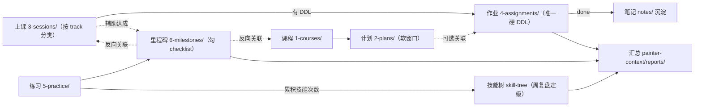

# painter-context/ 内容根

`painter-context/` 是唯一内容根，也是唯一事实源；schema 与命名契约见 `conventions.md`，技能定义见 `skill-tree.md`。`reports/` 只由脚本生成，不是事实来源；课程大纲、平台说明、聊天记录、草稿与其他参考材料都只是参考，不等于事实。

## 目录职责

| 目录 | 内容 |
| --- | --- |
| `1-courses/` | 课程定义（长期存在） |
| `2-plans/` | 逐课程目标/阶段的学习计划（软窗口，可分次录入） |
| `3-sessions/` | 按课程学习方向分类的上课记录 |
| `4-assignments/` | 作业（真实 DDL，硬截止） |
| `5-practice/` | 练习记录（已发生事实） |
| `6-milestones/` | 里程碑 checklist |
| `notes/` | 沉淀的知识点笔记（AI 汇总） |
| `templates/` | 录入模板 |
| `reports/` | 脚本生成的汇总，禁止手改 |

## 生命周期

## 边界对比

| A | B | 边界（一句话） |
| --- | --- | --- |
| `2-plans/` | `4-assignments/` | plan 是软窗口、可前后挪动；assignment 的 `due` 是唯一硬截止，plan 只读关联 assignment 的真实 `due`，不复制。 |
| `3-sessions/` | `5-practice/` | session 记录一次上课（发生过的课）；practice 记录一次自主练习，两者都是已发生事实，互不冒充。 |
| `6-milestones/` | `4-assignments/` | milestone 是阶段结果与 checklist，不携带 DDL；assignment 是带 `due` 的交付任务，不属于 milestone。 |
| `4-assignments/` | `notes/` | assignment 是待交付任务；作业完成后可把可复用知识沉淀成 `notes/`，二者不会互相替代。 |

事实与计划分层：

- 真实 DDL：`4-assignments/` 中每个 assignment 的 `due`
- 规划日期 / 排期日期：软安排，不等于硬截止，也不写进 `due`
- 课程计划的硬截止只从关联 assignment 的 `due` 读取；未关联作业时显示为无硬截止
- 课程大纲与学习规划只是参考，不能代替真实的 `due`、`date` 事实
- 非作业类备忘沉淀进 `notes/`；需要硬截止的事项建成 assignment

每次课的文件名为 `YYYY-MM-DD-<ascii-topic-slug>.md`，放在 `3-sessions/` 下与关联课程 `track` 一致的子目录；课前预习与课后课堂记录写在同一份 session 中。分类目录取关联课程的 `track`，不根据 `type` 或 `provider` 分类。

录入方式：让 AI 执行 `.github/prompts/` 下的 prompt，或直接复制 `templates/` 模板填写。写完跑 `npm run validate`。

课程目标或阶段计划按项新建 `2-plans/` 中的文件，窗口日期可按实际情况调整；计划总览由 `npm run rollup` 生成到 `reports/dashboard.md`，不手改报告。
